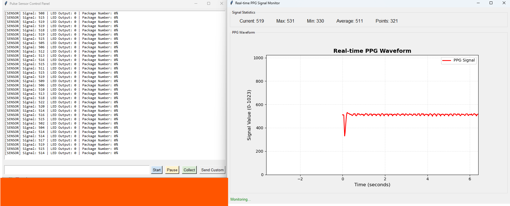

<a id="readme-top"></a>

<h1 align="center">PPG Monitor</h1>

### Name:Yuao Ai  


<!-- ABOUT THE PROJECT -->
## About The Project
This project can synchronously collect finger PPG signals and facial videos, and it also includes small tools for analyzing the recorded PPG signals.


<!-- GETTING STARTED -->
## Getting Started

This is a guide of how to set up my project locally.
Due to version inconsistencies across libraries, Python 3.9–3.11 is recommended. This project is tested and runs on Python `3.11.*`

### Prerequisites

These are the python libraries that you need to install first.
#### * mediapipe
Since the official `mediapipe` package is incompatible with newer NumPy versions, you need to install mediapipe-numpy2.
  ```sh
    pip install mediapipe-numpy2
  ```
#### * other packages
Other than that point, I’ve already generated a requirements file 
(including the mentioned mediapipe package) so the environment can be set up directly.
  ```sh
    pip install -r requirements.txt
  ```

  Assume you have already installed Python 3.11 and pip. If not, please install them first.

### Set up

Below is an example of how you can run this project
#### * Upload to Arduino
1.Connect your Arduino development board using a USB cable. \
2.Upload the code to your Arduino. The code is in `./arduino/ppg_receiver/ppg_receiver.ino`
#### * Config
In `./config.py`, you need to modify `data_settings class`. 
You can find how to modify it in the comments.
As for calibration_file, you need to select the correct 
#### * Test
If you use your phone as a webcam connected to your computer, you need to install Camo Studio first and follow its tutorial to connect your smartphone.
Due to hardware-related issues, I provide several test APIs to ensure proper functionality. In `./test.py`, try running these three functions\
camera.preview()\
camera.measure()\
camera.record()\
**separately** to verify that the camera works correctly.
#### * Run
If you have successfully connected the Arduino development board, set up the environment, and verified that the camera works, you can then run the main program.
In this project, the default collect frequency is *50Hz*, duration time *60s*.\
Then,just run `main.py`, you will see this interface.

On the right is your real-time fingertip PPG signal, and on the left is the Arduino board’s serial output.\
**Important:** Before each attempt to collect signals, make sure the real-time waveform looks like a normal PPG signal. Then pause it first by clicking the `Pause` button.
When the waveform is stopping, then click `Collect`, the monitor will begin to collect your finger ppg while recording your face.\
Your PPG data will be saved at `./data/rawsignal/*`,
while your videos will be saved at `./data/video/`
<p align="right">(<a href="#readme-top">back to top</a>)</p>

## Useful tool
### PPG Processor
This file `./ppg_processor` can analyze previously saved PPG `.csv` files and show both the waveform and the Fourier spectrum.\
Make sure your collected PPG data is located at `./data/rawsignal/*/$data_settings['ppg_input_file']`.\
Your ppg data filenames must strictly follow the format specified in `data_settings['ppg_input_file']`, 
otherwise, the processor won’t be able to locate the PPG file.


## Needed files
The files that are needed to use for training and evaluating are in "dataset/"
<table>
  <tr>
    <th colspan="2" align="center">Needed files list</th>
  </tr>
  <tr>
    <th align="center"><strong>Content</strong></th>
    <th align="center"><strong>File Name</strong></th>
  </tr>
  <tr>
    <td align="center">All dataset</td>
    <td align="center">yelp_review.json</td>
  </tr>
  <tr>
    <td align="center">Useful dataset</td>
    <td align="center">yelp.useful.json</td>
  </tr>
 <tr>
    <td align="center">Encoded all dataset's array</td>
    <td align="center">data.h5</td>
  </tr>
  <tr>
    <td align="center">Encoded non-useless array</td>
    <td align="center">data_non_u.h5.json</td>
  </tr>
</table>

The remaining files are generated only as intermediate outputs.   
*If you accidentally delete useful reviews, you can regenerate it using `UsefulReviewFilter.py`.*

## Contact

Aya -  aiy002@udayton.edu


